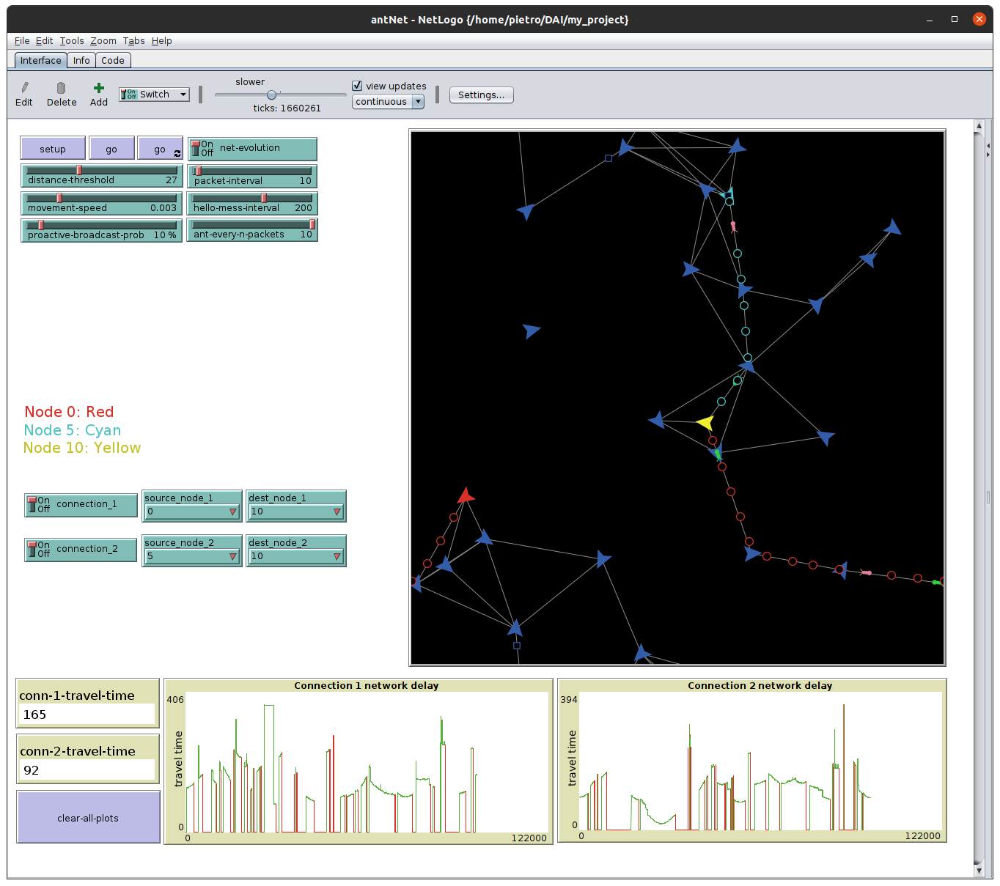

## AntNet
AntNet is a stochastic routing algorithm based on the idea "AntHocNet" for mobile, dynamic networks.
It is based on an collective behaviour which emerges in nature, the __ant foraging__ mechanism.
This project is part of the exam for the course "Distributed Artificial Intelligence" @ UniMoRe, Corso di laurea magistrale in Ingegneria informatica.

  
https://github.com/martinellop/ant-net/assets/64253220/48895d3a-9347-4e8d-8b72-1f437131bda5

